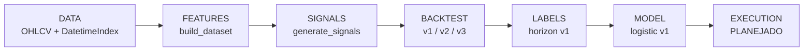

# WDO-EVOLVED-QUANT — Pipeline Status

**Última validação:** 29/05/2026 (PowerShell)  
**Pacote:** `microstructure/` em `WDO PROJECT 02`  
**Estágios 1–6 + validação ML + execução v1:** **OPERACIONAL**

---

## Arquitetura oficial (7 estágios)

```
DATA
  → FEATURES
  → SIGNALS
  → BACKTEST
  → LABELS
  → MODEL
  → EXECUTION
```



| # | Estágio | Status | Pacote / módulo | Entrada → Saída |
|---|---------|--------|-----------------|-----------------|
| 1 | **DATA** | ✓ OK | — | raw OHLCV → `df` indexado |
| 2 | **FEATURES** | ✓ OK | `features/` + `datasets.py` | `df` → `X` (matriz features) |
| 3 | **SIGNALS** | ✓ OK | `signal/signal_engine.py` | `X` → `X` + `signal` |
| 4 | **BACKTEST** | ✓ OK | `backtest/engine_v1.py` … `v3.py` | `df` + sinais → métricas + equity |
| 5 | **LABELS** | ✓ OK | `labeling/` (v1) | `df` → `y` (horizon); triple barrier = skeleton |
| 6 | **MODEL** | ✓ OK | `model/` (v1) | `X`, `y` → split → train → predict → metrics |
| 7 | **EXECUTION** | ✓ OK | `execution/` (v1) | sinais → posição simulada + métricas |

---

## Estágios 1–4 (implementados)

### 1. DATA

- `DatetimeIndex` monotônico obrigatório
- Colunas WDO: `abertura`, `alta`, `baixa`, `fechamento`, `volume`

### 2. FEATURES

```python
from microstructure.features.datasets import build_dataset
X = build_dataset(df)   # (n, 4) típico
```

| Componente | Caminho |
|------------|---------|
| Feature Engine | `features/base.py`, `registry.py`, `*.py` |
| Dataset Builder | `features/datasets.py` |

### 3. SIGNALS

```python
from microstructure.signal.signal_engine import generate_signals
X = generate_signals(X)   # + coluna signal → (n, 5)
```

### 4. BACKTEST

```python
from microstructure.backtest.engine_v1 import run_backtest      # baseline
from microstructure.backtest.engine_v2 import run_backtest_v2  # custos
from microstructure.backtest.engine_v3 import run_backtest_v3  # SL/TP/hold
```

| Versão | Extra |
|--------|--------|
| v1 | equity, métricas básicas |
| v2 | `cost_per_trade`, `slippage` |
| v3 | `max_hold_bars`, `stop_loss`, `take_profit`, `exit_reason` |

**Pipeline script (estágios 1–4):**

```python
from microstructure.run_pipeline import run_wdo_pipeline  # v1
# ou manual: build_dataset → generate_signals → run_backtest_v3
```

---

## Estágio 5 (implementado)

### 5. LABELS — alvo supervisionado (v1)

**Objetivo:** gerar `y` sem leakage (horizonte fixo; triple barrier em roadmap).

```python
from microstructure.features.datasets import build_dataset
from microstructure.labeling import create_horizon_labels, drop_invalid_label_rows

X = build_dataset(df)
y = create_horizon_labels(df, price_col="fechamento", horizon=5)
X_ml, y_ml = drop_invalid_label_rows(X, y)   # remove últimas `horizon` barras
```

| Módulo | Função |
|--------|--------|
| `labeling/horizon.py` | `create_horizon_labels` |
| `labeling/utils.py` | `drop_invalid_label_rows`, `validate_price_series` |
| `labeling/triple_barrier.py` | `create_triple_barrier_labels` — skeleton (`NotImplementedError`) |

**Docs:** `docs/labeling.md` | **Testes:** `tests/test_labeling_v1.py` (11 passed)

**Referência legada:** `08_MICROSTRUCTURE/labeling/` — não misturar imports

---

## Estágio 6 (implementado)

### 6. MODEL — baseline ML (v1)

```python
from microstructure.model import (
    train_test_split_time_series,
    train_logistic_model,
    predict_probabilities,
    generate_ml_signal,
    evaluate_classifier,
    drop_nan_feature_rows,
)

X_ml, y_ml = drop_invalid_label_rows(X, y)
X_ml, y_ml = drop_nan_feature_rows(X_ml, y_ml)
X_train, X_test, y_train, y_test = train_test_split_time_series(X_ml, y_ml, train_size=0.70)
model = train_logistic_model(X_train, y_train)
metrics = evaluate_classifier(model, X_test, y_test)
```

**Docs:** `docs/model_v1.md` | **Testes:** `tests/test_model_v1.py` (6 passed) | **Dep:** `scikit-learn`

**Walk-forward v1:** `walk_forward_validation()` — ver `docs/walkforward_v1.md`, `tests/test_walkforward_v1.py`

**Roadmap v2:** PurgedKFold, embargo, mais estimadores

---

## Estágio 7 (roadmap)

### 7. EXECUTION — produção

**Objetivo:** traduzir sinal + sizing + risco em ordens (simulado ou broker).

**Entradas:** sinal em tempo real, limites de risco, custos  
**Saídas:** ordens, logs, PnL live

**Diretório sugerido:** `microstructure/execution/`  
**Fora de escopo atual:** Profit One / automação visual (projeto V6-Follow-Trending é separado)

---

## Pipeline confirmado (detalhe estágios 1–4)

```
DATA
  → FEATURE ENGINE      (BaseFeature + @register_feature)
  → DATASET BUILDER     (build_dataset)
  → SIGNAL ENGINE       (generate_signals)
  → BACKTEST MODULE     (run_backtest v1/v2/v3)
```

| Etapa | Módulo | Função principal |
|-------|--------|------------------|
| DATA | — | `df` OHLCV + `DatetimeIndex` |
| FEATURE ENGINE | `microstructure/features/` | compute causal por feature |
| DATASET BUILDER | `microstructure/features/datasets.py` | `build_dataset(df)` |
| SIGNAL ENGINE | `microstructure/signal/signal_engine.py` | `generate_signals(X)` |
| BACKTEST MODULE | `microstructure/backtest/` | `run_backtest_v*` |

---

## Validações passadas

| Validação | Status |
|-----------|--------|
| Registry | ✓ |
| Autodiscover | ✓ |
| Feature Computation | ✓ |
| Dataset Build | ✓ |
| Signal Generation | ✓ |
| DatetimeIndex Requirement | ✓ |
| Backtest Module Import | ✓ |

---

## Output validado (PowerShell, n=200)

### Features — `build_dataset(df)`

```text
shape: (200, 4)
columns: ['delta', 'range', 'returns', 'volume_zscore']
```

### Features + signal — `generate_signals(X)`

```text
shape: (200, 5)   # 4 features + coluna signal
```

### Distribuição de sinais

```text
signal
 0     109
-1      66
 1      25
```

---

## Imports corretos

```python
from microstructure.features.datasets import build_dataset
from microstructure.signal.signal_engine import generate_signals
from microstructure.backtest.engine_v1 import run_backtest
```

```python
from microstructure.features.registry import REGISTRY, autodiscover, validate_registry
from microstructure.run_pipeline import run_wdo_pipeline
```

### Imports obsoletos (NÃO usar)

```python
from microstructure.features.dataset import build_dataset      # ❌
from microstructure.signals.generator import generate_signals  # ❌
```

---

## REQUISITO — DatetimeIndex

Todas as entradas para `build_dataset(df)` devem possuir:

```python
isinstance(df.index, pd.DatetimeIndex)  # True
df.index.is_monotonic_increasing        # True
```

**Exemplo válido:**

```python
import pandas as pd

idx = pd.date_range(
    "2024-01-01",
    periods=200,
    freq="min",
)

df = pd.DataFrame(
    {
        "abertura": [...],
        "fechamento": [...],
        "alta": [...],
        "baixa": [...],
        "volume": [...],
    },
    index=idx,
)

X = build_dataset(df)
```

| Coluna | Features |
|--------|----------|
| `abertura`, `fechamento` | delta, returns |
| `alta`, `baixa` | range |
| `volume` | volume_zscore |

---

## COMMON FAILURE MODES

### `TypeError: Index must be DatetimeIndex`

**Causa:** DataFrame sem índice temporal.  
**Solução:**

```python
df["datetime"] = pd.to_datetime(df["datetime"])
df = df.set_index("datetime").sort_index()
# ou: df.index = pd.date_range("2024-01-01", periods=len(df), freq="min")
X = build_dataset(df)
```

### `ValueError: build_dataset: índice deve ser monotônico crescente`

**Solução:** `df = df.sort_index()`

### `build_dataset: nenhuma coluna gerada (X vazio)`

**Solução:** `autodiscover()` + colunas OHLCV corretas.

### `generate_signals: colunas obrigatórias ausentes`

**Solução:** garantir `returns` e `delta` em `X` (features computadas).

---

## Próxima etapa oficial: EXECUTION

Model v1 validado (split temporal + logistic, 6 testes). Próximo bloco: **EXECUTION**.

Ver seções **Estágio 5** e **Estágios 6–7** acima.

---

## BACKTEST EXECUTION (concluído)

**Objetivo:** executar `run_backtest()` com sinais gerados e obter métricas básicas.  
**Regra:** não alterar features / registry / `generate_signals`.

### Script de execução (PowerShell / Python)

```python
import sys
sys.path.insert(0, r"C:\Users\fabio\Desktop\Projetos\WDO PROJECT 02")

import pandas as pd
from microstructure.features.datasets import build_dataset
from microstructure.signal.signal_engine import generate_signals
from microstructure.backtest.engine_v1 import run_backtest

# df: OHLCV com DatetimeIndex (200 barras no teste validado)
idx = pd.date_range("2024-01-01", periods=200, freq="min")
# df = pd.DataFrame({...}, index=idx)

# 1) Features
X = build_dataset(df)
print("FEATURES:", X.shape, list(X.columns))

# 2) Sinais
X = generate_signals(X)
print(X["signal"].value_counts())

# 3) Backtest
result = run_backtest(df, X["signal"], price_col="fechamento")

metrics = result["metrics"]
print(metrics)
```

### Métricas esperadas (`result["metrics"]`)

| Chave | Descrição |
|-------|-----------|
| `total_return` | retorno total da curva de equity |
| `sharpe` | Sharpe anualizado (× √252) |
| `max_drawdown` | drawdown máximo |
| `win_rate` | % trades com `strategy_return > 0` |
| `num_trades` | barras com `signal != 0` |

### CLI integrado

```powershell
cd "C:\Users\fabio\Desktop\Projetos\WDO PROJECT 02"
python -m microstructure.run_pipeline
```

---

## Regras de sinal (Signal Engine)

| `signal` | Condição |
|----------|----------|
| `1` | `returns > 0` e `delta > 0` |
| `-1` | `returns < 0` e `delta < 0` |
| `0` | caso contrário |

---

## Backtest (anti-lookahead)

```python
df["future_return"] = df["fechamento"].pct_change().shift(-1)
df["strategy_return"] = df["position"] * df["future_return"]
```

Usar sempre `price_col="fechamento"` no WDO.

---

## Árvore `microstructure/`

```text
microstructure/
├── features/          # FEATURE ENGINE + DATASET BUILDER
├── signal/            # SIGNAL ENGINE
├── backtest/          # BACKTEST MODULE
├── run_pipeline.py
└── tests/
```

---

## Testes

```powershell
python -m pytest microstructure/tests/ -v
```

---

## Roadmap ordenado

| Ordem | Estágio | Entregável |
|-------|---------|------------|
| ✓ | BACKTEST v2/v3 | custos + SL/TP/hold |
| ✓ | LABELS v1 | horizon labels + anti-leakage tests |
| ✓ | MODEL v1 | split temporal + logistic + metrics |
| 1 | EXECUTION | paper trading / log de ordens |
| 3 | Dados reais WDO | CSV/Parquet em `data/` |
| 4 | Integração `07_VALIDATION/` | métricas institucionais |

---

## Notas

- Pipeline ativo: **`microstructure/`** (não confundir com `08_MICROSTRUCTURE/`).
- `REGISTRY.list()` vazio: reinicie kernel ou `autodiscover()`.
- Shape `(200, 5)` refere-se a **X após `generate_signals`** (4 features + `signal`).
